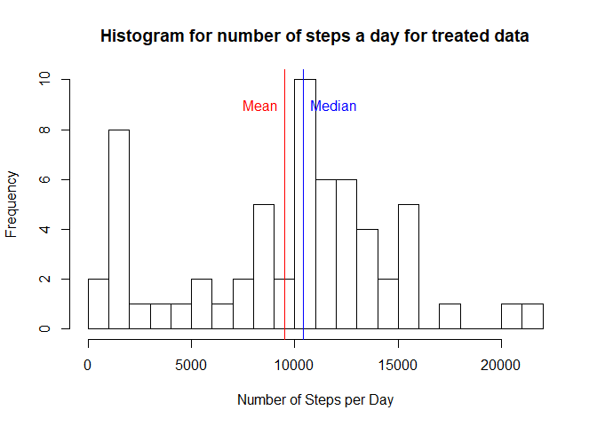

## Loading and preprocessing the data  

The packages required to run and reproduce the code are listed.  

1. dplyr
2. ggplot2
3. gridExtra
4. taRifx
5. lattice


This code supose that file "activity.zip" is available at working directory.  


```r
fileURL <- "https://d396qusza40orc.cloudfront.net/repdata%2Fdata%2Factivity.zip"
fileNameZip <- "activity.zip"
fileNameCSV <- "activity.csv"

if(!file.exists(fileNameZip)){
  download.file(fileURL,fileNameZip)
}

if(!file.exists(fileNameCSV)){
  unzip("activity.zip")
}

activity <-  read.csv("activity.csv", sep = ",") %>%
  transform(steps <- as.numeric(steps)) %>%
  remove.factors() #Factors where removed to avoid be plotted on graphics
activity$date <- as.Date(activity$date, "%Y-%m-%d")
```

## What is mean total number of steps taken per day?

For this part of task it is used only the complete cases of data set.  


```r
complete_activity <- complete.cases(activity)
act_no_NA <- activity[complete_activity,]

# Using aggregate funcion grouping data by day and calculating sum, mean and median

sum_steps_day <- aggregate(act_no_NA$steps, list(act_no_NA$date), sum)
mean_steps_day <- aggregate(act_no_NA$steps, list(act_no_NA$date), mean)
median_steps_day <- aggregate(act_no_NA$steps, list(act_no_NA$date), median) #The value is 0 for each day
```

The mean and median for the total of steps per day are respectively:


```r
total_mean_steps_day <-  mean(sum_steps_day$x)
total_median_steps_day <- median(sum_steps_day$x)
print(paste("Mean of total of steps a day :", total_mean_steps_day))
```

```
## [1] "Mean of total of steps a day : 10766.1886792453"
```

```r
print(paste("Median of total of steps a day :", total_median_steps_day))
```

```
## [1] "Median of total of steps a day : 10765"
```

Considering this values are so close, only the median value is shown in the histogram.


```r
hist(sum_steps_day$x, breaks = 20, xlab = "Number of Steps per Day", 
     main = "Histogram for number of steps a day")
abline(v=total_median_steps_day,col="blue")
text(total_median_steps_day+350,9,"Median", col="blue", adj=c(0,0.5))
```

<!-- -->


## What is the average daily activity pattern?

The activity dataset has  information gathered in intervals of 5 minutes that can be used to profile de activity pattern, the code to arrage the data follow:


```r
# Agregating data acording 5 minutes interval
avg_steps_interval <- aggregate(act_no_NA$steps, list(factor(act_no_NA$interval)), median)
avg_steps_interval <- remove.factors(avg_steps_interval)  # Factor removed to plot data


# Search interval with high mean value

max_interval <- avg_steps_interval$Group.1[which.max(avg_steps_interval$x)]
max_mean_estep <- avg_steps_interval$x[which.max(avg_steps_interval$x)]
print(paste("The maximun mean step value occurs at interval: ", max_interval,
           "at value of:", max_mean_estep))
```

```
## [1] "The maximun mean step value occurs at interval:  845 at value of: 60"
```

```r
# Subseting neighbour maximum value data

interval_x <- as.character(seq(as.numeric(max_interval)-100,as.numeric(max_interval)+100,5))
selec_interval <- filter(avg_steps_interval,Group.1 %in% interval_x)
```

The results mean of number steps acording to the interval can be observed in the graphics that follow.


```r
# Plotting results for entire intervals
plot(avg_steps_interval$Group.1,avg_steps_interval$x, type = "l", xlab="Five minute interval", ylab = "Mean of steps", main = "Daily activity")
```

<!-- -->

A zoom at the interest point.


```r
# A zoom at the nighbour of maximum point

plot(selec_interval$Group.1,selec_interval$x, type = "l", xlab="Five minute interval", ylab = "Mean of steps", main = "Zoom at daily activity")
abline(v=max_interval, col="blue", lwd=2)
text(as.character(as.numeric(max_interval)+5),50,"Max steps", col="blue", adj=c(0,0.5))
```

<!-- -->


## Imputing missing values

At the previous session it was calculated the mean of steps for each interval a day. The idea is to reconstruct the missing values substituting then for the interval median as follow.  

First: an evaluation of amount of missing values:


```r
# Calculating amount of missing values

nrow_dataset <- nrow(activity)
missing_values_dataset <- sum(!complete_activity)
percent_missing_values <- (missing_values_dataset/nrow_dataset)*100

print(paste("The data set contain ", percent_missing_values,"% of missing values"))
```

```
## [1] "The data set contain  13.1147540983607 % of missing values"
```

Second: complete the missing values with its corresponding mean value for profile interval.


```r
filled_activity <- activity

# This loop will iterate trhoug values of steps changing NA for mmean value.
for ( i in 1:nrow_dataset){
  if (is.na(filled_activity$steps[i])){
    filled_activity$steps[i] <- with(avg_steps_interval,x[which(Group.1==filled_activity$interval[i])])
  }
}
```

Observing the histogram for sum of steps each day at the data set without NA in comparisson with original dataset is it possible to conclude that the strategy to treat NA values didn´t affect too much the overall result, that is more skewed to left now.


```r
# Using aggregate funcion grouping data by day and calculating sum, mean and median

sum_steps_day_filled <- aggregate(filled_activity$steps, list(filled_activity$date), sum)
mean_steps_day_filled <- aggregate(filled_activity$steps, list(filled_activity$date), mean)
median_steps_day_filled <- aggregate(filled_activity$steps, list(filled_activity$date), median) #The value is 0 for each day

total_mean_steps_day_filled <-  mean(sum_steps_day_filled$x)
total_median_steps_day_filled <- median(sum_steps_day_filled$x)
print(paste("Mean of total of steps a day :", total_mean_steps_day_filled))
```

```
## [1] "Mean of total of steps a day : 9503.86885245902"
```

```r
print(paste("Median of total of steps a day :", total_median_steps_day_filled))
```

```
## [1] "Median of total of steps a day : 10395"
```

The result of data manipulation can be observed in the follow histogram.


```r
hist(sum_steps_day_filled$x, breaks = 20, xlab = "Number of Steps per Day", 
     main = "Histogram for number of steps a day for treated data")
abline(v=total_median_steps_day_filled,col="blue")
text(total_median_steps_day_filled+350,9,"Median", col="blue", adj=c(0,0.5))
abline(v=total_mean_steps_day_filled,col="red")
text(total_mean_steps_day_filled-350,9,"Mean", col="red", adj=c(1,0.5))
```

<!-- -->


## Are there differences in activity patterns between weekdays and weekends?

The activity patterns show more steps during the weekends. 


```r
# With the following steps two colunms will be added to dataset
# weekday: colunm with days of week
# weekend: colunm specifying a day as weekend or weekday
filled_activity$weekday <- weekdays(filled_activity$date, abbreviate = TRUE)
filled_activity$weekend <- factor(filled_activity$weekday
                                  , levels = unique(filled_activity$weekday)
                                  , labels=c(rep("weekdays",5),rep("weekend",2)))

# Grouping data acording type of day

avg_filled_activity_weekend <- filled_activity %>%
                          select(interval,weekend,steps) %>%
                          group_by(interval, weekend) %>% 
                          summarise(steps = mean(steps))


# Caculate the mean of steps for types of day

mean_weekday <- mean(filter(avg_filled_activity_weekend, weekend == "weekdays")$steps)
mean_weekend <- mean(filter(avg_filled_activity_weekend, weekend == "weekend")$steps)

print(paste("Mean steps during weekdays is: ", mean_weekday))
```

```
## [1] "Mean steps during weekdays is:  31.154475308642"
```

```r
print(paste("Mean steps during weekends is: ", mean_weekend))
```

```
## [1] "Mean steps during weekends is:  38.1888020833333"
```

This is confirmed observing the graphic analysis as follow.


```r
xyplot(steps ~ interval | weekend, data = avg_filled_activity_weekend,
       type = "l", 
       layout = c(1,2),
       xlab = "Interval",
       ylab = "Average steps",
       panel = function(x, y, ...) {
       panel.xyplot(x, y, ...)
       panel.abline(h = median(y), lty = 2)})
```

<!-- -->


